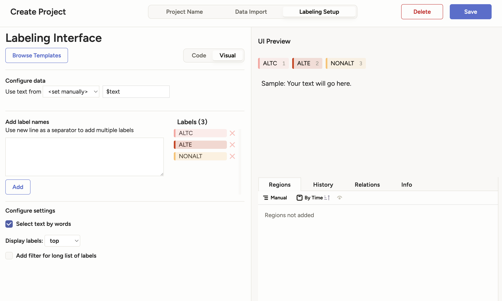

# Mise en place
Ce dépôt sert de guide pour mettre en place label studio et annoter les adverbiaux de localisation temporelle.

Pour commencer, clonez le dépôt. Créez un nouvel environement virtuel et installez les dépendances `pip install -r requirements.txt`. 

Le corpus que vous souhaitez annoter doit être au format txt. Placez le dans [`./corpus/raw`](./corpus/raw/). 
Le script [`./src/pre_annotator.py`](src/pre_annotator.py) permet de pré-annoter votre corpus dans un format que l'on peut ensuite importer dans label studio. Placez vous dans le dossier [`./src`](src/) et lancez la commande `python pre_annotator.py --corpus
-folder ../corpus/gold/raw/ --save-folder ../corpus/annotated/`. Vos fichiers annotés se trouvent désormais dans le dossier [`./corpus/annotated`](./corpus//annotated/). 

Vous pouvez maintenant démarrer label-studio, mais il reste une toute petite chose à faire. Par défault, label-studio ne permet d'upload que 100 fichiers à la fois. On peut régler ce problème en modifiant la variable d'environement `DATA_UPLOAD_MAX_NUMBER_FILES`. Si vous êtes dans un shell Unix (comme bash ou zsh), tapez `export DATA_UPLOAD_MAX_NUMBER_FILES={nombre de fichiers dans votre corpus}`. 
Vous pouvez maintenant rééllement démarrer label studio avec la commande ... `label-studio start` !

Dans le menu, cliquez sur "Create project". Nommez-le comme bon vous semble, puis rendez-vous dans la section "data import". Ajoutez vos fichiers pré-annotés. 

Rendez vous ensuite dans l'onglet "labeling setup". Sélectionnez le template "named entity recognition" dans l'onglet "natural language processing". 

Supprimez les quatre labels "PER" "ORG" "LOC" et "MISC" et remplacez les par "ALTC" "ALTE" et "NONALT". Votre interface devrait ressembler à cela :

Je vous conseille de sélectionner l'option "Select text by words". Cela rend l'annotation beaucoup plus agréable. Cela peut poser problème avec les apostrophes, mais on peut toujours la désactiver pour une sélection plus tard. 

Vous pouvez maintenant commencer à annoter !

# Fine tuning

Après avoir annoté suffisament de phrases (disons une centaine), vous pouvez les utiliser pour fine-tuner le modèle.
